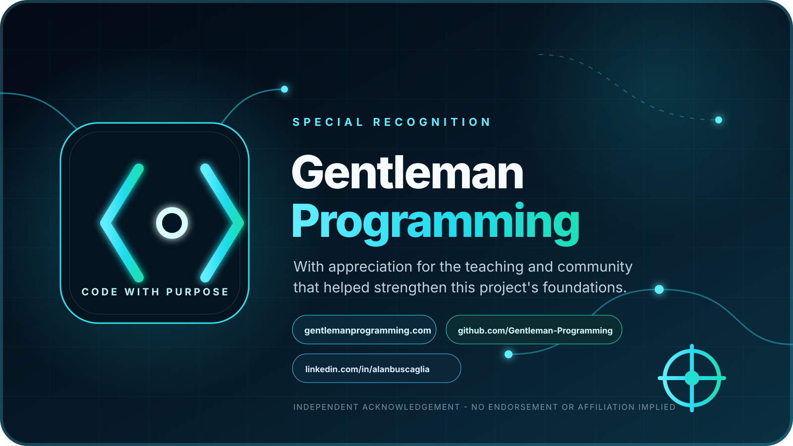

[English](ACKNOWLEDGEMENTS.md) | [Español](ACKNOWLEDGEMENTS.es.md)

# Acknowledgements

SourceRudder gratefully recognizes the open-source communities and ecosystems that make this project possible, including:

- [Go](https://go.dev/) and its standard-library and module ecosystem.
- [Model Context Protocol (MCP)](https://modelcontextprotocol.io/) and its interoperability community.
- [SearXNG](https://searxng.org/) for metasearch capabilities.
- [GitHub](https://github.com/) and the public developer ecosystem that supports code and issue research.
- The package, registry, documentation, academic, community, and media ecosystems accessed through the project's connectors.

## Community recognition

SourceRudder also recognizes [Gentleman Programming](https://gentlemanprogramming.com/#install), the [Gentleman Programming GitHub community](https://github.com/Gentleman-Programming), and [Alan Buscaglia](https://www.linkedin.com/in/alanbuscaglia/) for educational work centered on stronger developer foundations.

These acknowledgements are credits, not an endorsement or a statement of affiliation. Dependencies and external services retain their own terms and licenses.

## License status

SourceRudder 2.0.0 and the historical IA_Buscar line are distributed under the [MIT License](LICENSE). Existing MIT grants remain valid for every recipient of those copies.
