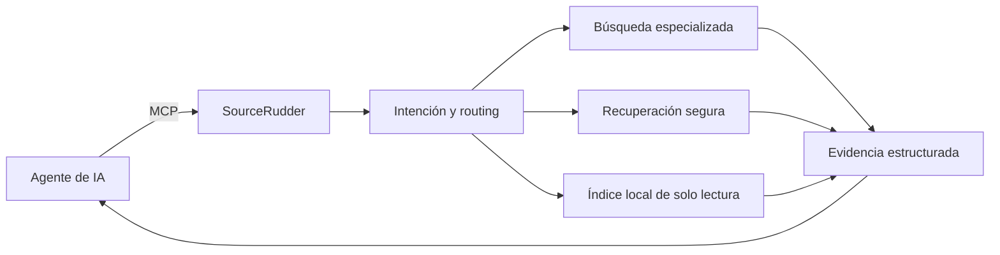

<p align="center">
  
</p>

<p align="center"><strong>Ofrece a tus agentes evidencia que puedan inspeccionar, no otra respuesta opaca.</strong></p>

[English](README.md) | [Español](README.es.md)

<p align="center">
  <a href="https://github.com/mdesantis1984/SourceRudder/actions/workflows/ci.yml"></a>
  
  
  
  <a href="https://github.com/mdesantis1984/SourceRudder/releases"></a>
  <a href="LICENSE"></a>
</p>

<p align="center">
  <a href="#pruébalo-localmente">Ejecutarlo localmente</a> ·
  <a href="#superficie-de-investigación">Explorar 28 herramientas</a> ·
  <a href="#cómo-funciona">Ver la arquitectura</a> ·
  <a href="docs/mcp-clients.es.md">Conectar un cliente MCP</a> ·
  <a href="https://github.com/mdesantis1984/SourceRudder/releases">Releases</a>
</p>

SourceRudder es un gateway de investigación autoalojado y nativo de MCP para
desarrolladores que necesitan acceder a muchas fuentes sin entregar todo el
recorrido de investigación a un único proveedor de respuestas. Reúne búsqueda,
recuperación segura, síntesis local, caché, historial y conocimiento curado por
el operador detrás de una interfaz estable.

> **Preview privada:** SourceRudder 2.0.0 está implementado y verificado, pero
> todavía no tiene un release público. El repositorio permanece privado mientras
> finalizan las revisiones de marca y licencia. No se afirman adopción, clientes
> ni una red completamente privada.

## Por qué SourceRudder

| Lo que necesita tu agente | Lo que aporta SourceRudder |
|---|---|
| Más que una caja de búsqueda genérica | Herramientas específicas para código, paquetes, documentación oficial, academia, comunidades, medios, noticias, imágenes y web. |
| Evidencia que pueda procesar | Arrays estables, metadata de fuentes, strategy IDs, warnings, errores, estado de caché y resultados parciales explícitos. |
| Una capa de investigación gobernable | Routing autoalojado, HTTP autenticado, `stdio` local, recuperación acotada, métricas observables y un corpus local inmutable opcional. |

Úsalo para agentes de programación, copilotos técnicos, automatización interna o
cualquier flujo donde **el camino hasta la evidencia importe tanto como la respuesta**.

## Pruébalo localmente

Requisitos: Go 1.26.6+, Docker y Docker Compose v2.

```bash
git clone https://github.com/mdesantis1984/SourceRudder.git
cd SourceRudder
cp .env.example .env
# Configura valores independientes para SOURCERUDDER_AUTH_KEY y SEARXNG_SECRET.
docker compose up --build -d
curl -fsS http://127.0.0.1:8080/healthz
docker compose logs -f sourcerudder
```

Compose ejecuta `sourcerudder` y publica HTTP en
`127.0.0.1:${SOURCERUDDER_PORT:-8080}`. Para detenerlo: `docker compose down`.

### Conecta un cliente MCP local

```json
{
  "mcpServers": {
    "sourcerudder": {
      "command": "/ruta/absoluta/a/sourcerudder",
      "args": ["-transport", "stdio"]
    }
  }
}
```

Consulta [Clientes MCP](docs/mcp-clients.es.md) para HTTP autenticado y patrones
de configuración probados.

### Compila y prueba

```bash
go build -o bin/sourcerudder ./cmd/sourcerudder
go test ./...
go test -race ./...
go vet ./...
```

### Ejecuta sin Compose

```bash
./bin/sourcerudder -transport stdio -searxng-url http://localhost:8888

SOURCERUDDER_AUTH_KEY='<secreto-local>' \
SEARXNG_URL='http://localhost:8888' \
./bin/sourcerudder -transport http -http-addr :8080
```

| Endpoint | Acceso | Propósito |
|---|---|---|
| `GET /healthz` | Público | Respuesta mínima de liveness. |
| `POST /mcp` | Bearer token | Frontera JSON-RPC de MCP. |
| `GET /metrics` | Bearer token | Métricas Prometheus. |

## Cómo funciona



El gateway no oculta el comportamiento de los proveedores detrás de una
respuesta pulida. Cada herramienta devuelve fuentes e información suficiente
para que el agente decida si continúa, reintenta, degrada o se detiene.

## Superficie de investigación

El recurso MCP `agent-guide://sourcerudder/wire-contract` documenta el contrato
estable mediante `resources/list` y `resources/read`. Las respuestas mantienen
arrays JSON para `results`, `sourcesUsed`, `warnings` y `errors`; `results`
nunca es `null`.

| Grupo | Herramientas |
|---|---|
| Búsqueda | `search_web`, `search_news`, `search_doc_oficial`, `search_local_index`, `search_github`, `search_github_pr`, `search_github_issue`, `search_stackoverflow`, `search_npm`, `search_nuget`, `search_pypi`, `search_docker_hub`, `search_academic`, `search_reddit`, `search_youtube`, `search_images` |
| Recuperación y validación | `fetch_url`, `fetch_and_extract`, `extract_structured`, `validate_url`, `check_link_status` |
| Síntesis | `summarize_results`, `deep_research`, `compare_sources` |
| Utilidades con estado | `get_cached`, `invalidate_cache`, `get_search_history`, `get_current_date` |

### Disponible hoy

| Superficie | Estado verificado |
|---|---|
| Servidor MCP | 28 herramientas registradas sobre `stdio` y HTTP autenticado. |
| Búsqueda | 16 herramientas específicas con cantidad de resultados acotada. |
| Recuperación | Validación de URL, controles de redirects/DNS, extracción, reintentos y estados explícitos de bloqueo o fallo. |
| Investigación local | Corpus JSON inmutable y curado por el operador, sin crawling ni fallback de red. |
| Operaciones | Métricas Prometheus, health endpoint, Docker Compose, Kubernetes y systemd. |
| Distribución | Preview privada 2.0.0; archivos finales e imagen GHCR todavía bloqueados por los gates. |

Los conectores incluyen SearXNG, GitHub, Stack Overflow, npm, NuGet, PyPI,
Docker Hub y el registro de documentación oficial. Los strategy IDs permanecen
estables, incluidos `official_doc_registry_search`,
`official_doc_web_fallback`, `local_index_lexical` y
`local_index_unavailable`.

## Control sin promesas de caja negra

- Las búsquedas externas contactan a los proveedores configurados; autoalojado
  no significa que cada request permanezca dentro de tu red.
- La síntesis local agrupa, compara y resume de forma determinista; no realiza
  una llamada oculta a otro LLM.
- El índice local lee un único corpus validado y nunca recorre tu filesystem.
- La recuperación valida redirects y destinos resueltos para reducir exposición
  a SSRF y conserva estados explícitos de bloqueo y degradación.

## Configuración y seguridad

| Variable | Propósito |
|---|---|
| `SOURCERUDDER_AUTH_KEY` | Secreto requerido para autenticar MCP HTTP y métricas. |
| `SOURCERUDDER_PORT` | Puerto del host para Compose; el default es `8080`. |
| `SEARXNG_URL` | Endpoint de SearXNG; default `http://localhost:8888`. |
| `LOCAL_INDEX_PATH` | Corpus local de solo lectura opcional. |
| `MEMORY_URL`, `MEMORY_APIKEY` | Integración opcional con IA_Recuerdo; sin I/O si `MEMORY_URL` está vacío. |
| `FETCH_USER_AGENT`, `FETCH_TIMEOUT_MS`, `FETCH_MAX_REDIRECTS`, `FETCH_MAX_ATTEMPTS` | Controles del fetcher. |

Mantén los secretos fuera de Git y de los flags. No expongas HTTP directamente
a Internet: usa una red privada o un reverse proxy TLS con controles de acceso.
Consulta [Seguridad](SECURITY.es.md).

## Entorno QA local

```bash
export QA_AUTH_KEY="$(openssl rand -hex 32)"
make qa-build
make qa-up
make qa-smoke
make qa-down
```

El stack QA aislado publica sólo en loopback y permanece separado del proyecto
Compose de inicio rápido. El archivo opcional `.env.qa` es exclusivo de
desarrollo; nunca incluyas credenciales de producción.

## Elige tu recorrido

- **Evaluarlo:** sigue el [inicio rápido](#pruébalo-localmente) y ejecuta una
  consulta respaldada por fuentes.
- **Conectarlo:** usa la [guía de clientes MCP](docs/mcp-clients.es.md) para
  `stdio` o HTTP autenticado.
- **Operarlo:** empieza por [despliegue](docs/deployment.es.md),
  [configuración](docs/configuration.es.md) y [operaciones](docs/operations.es.md).
- **Extenderlo:** lee [Contribuir](CONTRIBUTING.es.md) y propón un conector o
  mejora de contrato mediante un issue aprobado.

## Documentación

[Migración a 2.0](MIGRATION-TO-2.0.es.md) · [Changelog](CHANGELOG.es.md) ·
[Arquitectura](docs/architecture.es.md) · [Desarrollo](docs/development.es.md) ·
[Despliegue](docs/deployment.es.md) · [Configuración](docs/configuration.es.md) ·
[Operaciones](docs/operations.es.md) · [Clientes MCP](docs/mcp-clients.es.md) ·
[Seguridad](SECURITY.es.md) · [Agradecimientos](ACKNOWLEDGEMENTS.es.md)

## Licencia y estado del release

La [LICENSE](LICENSE) raíz sigue siendo MIT mientras se espera la revisión
profesional de la licencia SourceRudder propuesta. No se afirma aprobación legal.
El draft privado de 2.0.0 es preparación, no publicación; las releases históricas
de IA_Buscar conservan sus derechos MIT.

---

<p align="center"><strong>Dirige cada búsqueda. Ve cada fuente.</strong></p>
