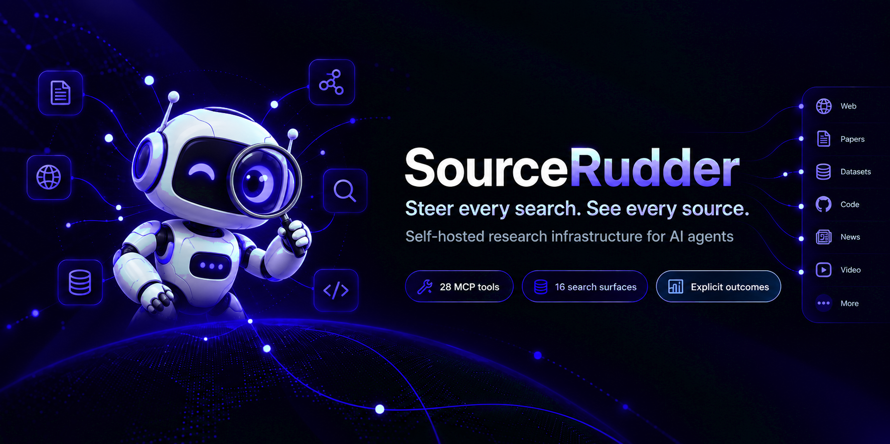
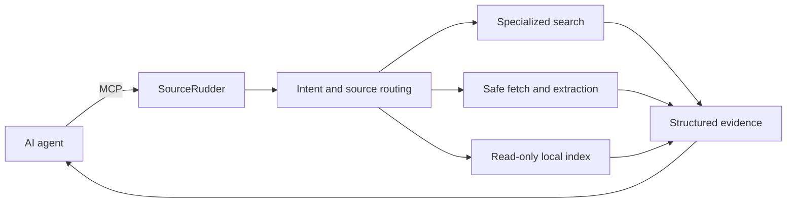
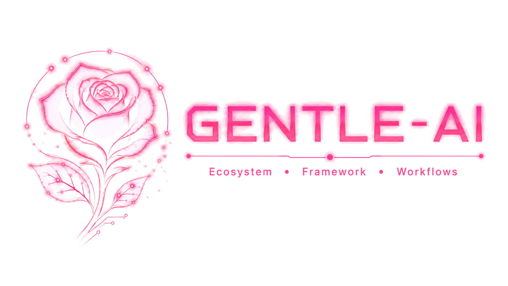

<p align="center">
  
</p>

<p align="center"><strong>Give AI agents evidence they can inspect, not another opaque answer.</strong></p>

[English](README.md) | [Español](README.es.md)

<p align="center">
  <a href="https://github.com/mdesantis1984/SourceRudder/actions/workflows/ci.yml"></a>
  
  
  
  <a href="https://github.com/mdesantis1984/SourceRudder/releases/tag/v2.0.0"></a>
  <a href="LICENSE"></a>
</p>

<p align="center">
  <a href="#try-it-locally">Run it locally</a> ·
  <a href="#research-surface">Explore 28 tools</a> ·
  <a href="#how-it-works">See the architecture</a> ·
  <a href="docs/mcp-clients.md">Connect an MCP client</a> ·
  <a href="https://github.com/mdesantis1984/SourceRudder/releases">Releases</a>
</p>

SourceRudder is a self-hosted, MCP-native research gateway for developers who
want broad source access without giving one answer provider control of the
entire research path. It brings search, safe retrieval, local synthesis,
caching, history, and operator-curated knowledge behind one stable interface.

> **SourceRudder 2.0.0:** the first public release delivers the renamed product,
> stable MCP contracts, hardened deployment assets, and a verifiable supply
> chain. No adoption, customer, or fully-private-network claim is made.

## Why SourceRudder

| What your agent needs | What SourceRudder provides |
|---|---|
| More than one generic search box | Purpose-built tools for code, packages, official docs, academia, communities, media, news, images, and the web. |
| Evidence it can reason about | Stable result arrays, source metadata, strategy IDs, warnings, errors, cache state, and explicit partial outcomes. |
| A research layer you can govern | Self-hosted routing, authenticated HTTP, local `stdio`, bounded fetch behavior, observable metrics, and an optional immutable local corpus. |

Use it for coding agents, technical copilots, internal research automation, or
any workflow where the **route to the evidence matters as much as the answer**.

## Try it locally

Requirements: Go 1.26.6+, Docker, and Docker Compose v2.

```bash
git clone https://github.com/mdesantis1984/SourceRudder.git
cd SourceRudder
cp .env.example .env
# Set independent SOURCERUDDER_AUTH_KEY and SEARXNG_SECRET values in .env.
docker compose up --build -d
curl -fsS http://127.0.0.1:8080/healthz
docker compose logs -f sourcerudder
```

Compose runs the `sourcerudder` service and binds the HTTP port to
`127.0.0.1:${SOURCERUDDER_PORT:-8080}`. Stop it with `docker compose down`.

### Connect a local MCP client

```json
{
  "mcpServers": {
    "sourcerudder": {
      "command": "/absolute/path/to/sourcerudder",
      "args": ["-transport", "stdio"]
    }
  }
}
```

See [MCP clients](docs/mcp-clients.md) for authenticated HTTP and tested client
configuration patterns.

### Build and test

```bash
go build -o bin/sourcerudder ./cmd/sourcerudder
go test ./...
go test -race ./...
go vet ./...
```

### Run without Compose

```bash
./bin/sourcerudder -transport stdio -searxng-url http://localhost:8888

SOURCERUDDER_AUTH_KEY='<local-secret>' \
SEARXNG_URL='http://localhost:8888' \
./bin/sourcerudder -transport http -http-addr :8080
```

| Endpoint | Access | Purpose |
|---|---|---|
| `GET /healthz` | Public | Minimal liveness response. |
| `POST /mcp` | Bearer token | MCP JSON-RPC boundary. |
| `GET /metrics` | Bearer token | Prometheus metrics. |

## How it works



The gateway does not hide provider behavior behind a polished answer. Every
tool returns enough source and outcome information for a downstream agent to
decide whether to continue, retry, degrade, or stop.

## Research surface

The MCP resource `agent-guide://sourcerudder/wire-contract` documents the stable
wire contract through `resources/list` and `resources/read`. Search responses
keep JSON arrays for `results`, `sourcesUsed`, `warnings`, and `errors`;
`results` is never `null`.

| Group | Tool names |
|---|---|
| Search | `search_web`, `search_news`, `search_doc_oficial`, `search_local_index`, `search_github`, `search_github_pr`, `search_github_issue`, `search_stackoverflow`, `search_npm`, `search_nuget`, `search_pypi`, `search_docker_hub`, `search_academic`, `search_reddit`, `search_youtube`, `search_images` |
| Fetch and validate | `fetch_url`, `fetch_and_extract`, `extract_structured`, `validate_url`, `check_link_status` |
| Synthesis | `summarize_results`, `deep_research`, `compare_sources` |
| Stateful utilities | `get_cached`, `invalidate_cache`, `get_search_history`, `get_current_date` |

### Available today

| Surface | Verified state |
|---|---|
| MCP server | 28 registered tools over `stdio` and authenticated HTTP. |
| Search | 16 source-specific tools with bounded result counts. |
| Retrieval | URL validation, redirect/DNS checks, extraction, retries, and explicit blocked/failure outcomes. |
| Local research | Immutable operator-curated JSON corpus with no crawling or network fallback. |
| Operations | Prometheus metrics, health endpoint, Docker Compose, Kubernetes, and systemd assets. |
| Distribution | Public 2.0.0 archives and GHCR image with checksums, SBOM, provenance, and attestations. |

Connectors include SearXNG, GitHub, Stack Overflow, npm, NuGet, PyPI, Docker
Hub, and the official-documentation registry. Relevant strategy IDs remain
stable across tools, including `official_doc_registry_search`,
`official_doc_web_fallback`, `local_index_lexical`, and
`local_index_unavailable`.

## Control without black-box claims

- External searches still contact the providers you configure; self-hosted does
  not mean every request remains inside your network.
- Local synthesis is deterministic grouping, comparison, and summarization, not
  an undisclosed LLM call.
- The local index reads one validated corpus and never crawls your filesystem.
- URL retrieval validates redirect hops and resolved targets to reduce SSRF
  exposure while preserving explicit blocked and degraded states.

## Configuration and security

| Variable | Purpose |
|---|---|
| `SOURCERUDDER_AUTH_KEY` | Required secret for HTTP MCP and metrics authentication. |
| `SOURCERUDDER_PORT` | Compose host port; defaults to `8080`. |
| `SEARXNG_URL` | SearXNG endpoint; defaults to `http://localhost:8888`. |
| `LOCAL_INDEX_PATH` | Optional read-only local-index corpus. |
| `FETCH_USER_AGENT`, `FETCH_TIMEOUT_MS`, `FETCH_MAX_REDIRECTS`, `FETCH_MAX_ATTEMPTS` | Fetcher controls. |

Keep secrets out of Git and command-line flags. Do not expose HTTP directly to
the Internet; use a private network or a TLS reverse proxy with request and
access controls. See [Security](SECURITY.md).

## Local QA environment

```bash
export QA_AUTH_KEY="$(openssl rand -hex 32)"
make qa-build
make qa-up
make qa-smoke
make qa-down
```

The isolated QA stack publishes only to loopback and remains separate from the
quickstart Compose project. The optional `.env.qa` file is dev-only; never place
production credentials in it.

## Choose your path

- **Evaluate it:** run the [local quickstart](#try-it-locally) and make one
  source-backed query.
- **Connect it:** use the [MCP client guide](docs/mcp-clients.md) for `stdio` or
  authenticated HTTP.
- **Operate it:** start with [deployment](docs/deployment.md),
  [configuration](docs/configuration.md), and [operations](docs/operations.md).
- **Extend it:** read [Contributing](CONTRIBUTING.md) and propose a connector or
  contract improvement through an approved issue.

## Community recognition

[](ACKNOWLEDGEMENTS.md#community-recognition)

SourceRudder recognizes the teaching and community behind [Gentleman Programming](https://gentlemanprogramming.com/#install). The linked acknowledgements include its official GitHub and Alan Buscaglia's LinkedIn profile without implying endorsement or affiliation.

## Documentation

[Migration to 2.0](MIGRATION-TO-2.0.md) · [Changelog](CHANGELOG.md) ·
[Architecture](docs/architecture.md) · [Development](docs/development.md) ·
[Deployment](docs/deployment.md) · [Configuration](docs/configuration.md) ·
[Operations](docs/operations.md) · [MCP clients](docs/mcp-clients.md) ·
[Brand assets](docs/brand.md) · [Security](SECURITY.md) · [Acknowledgements](ACKNOWLEDGEMENTS.md)

## License and release status

SourceRudder 2.0.0 and the historical IA_Buscar line are distributed under the
[MIT License](LICENSE). MIT permits commercial and non-commercial use,
modification, redistribution, sublicensing, and sale subject to preserving its
copyright and permission notice.

---

<p align="center"><strong>Steer every search. See every source.</strong></p>
